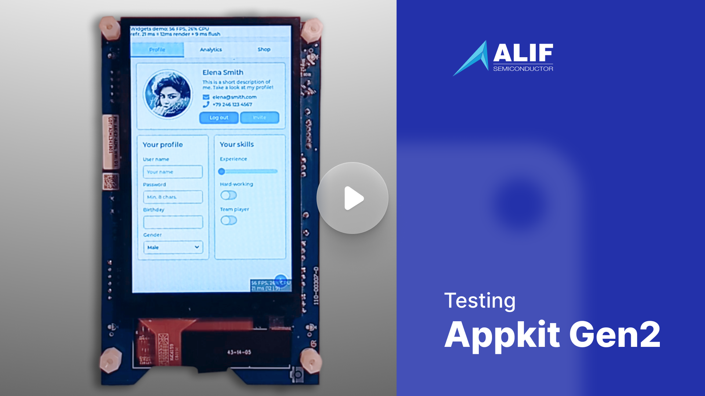

# LVGL ported to Alif M55

## Overview

This port is for the Alif Ensemble E7 AI/ML AppKit boards.

Alif Semiconductor is a next-generation chip vendor making chips that come in a
variety of configurations.

The E7 AI/ML AppKit is a peripheral-rich board with the most powerful Alif Ensemble SOC.

For more info about this board and Alif, see https://docs.lvgl.io/master/details/integration/chip/alif.html .

## Buy

You can purchase the Alif Ensemble E7 AI/ML AppKit from https://www.arrow.com/en/products/ak-e7-aiml/alif-semiconductor and https://www.mouser.com/ProductDetail/Alif-Semiconductor/AK-E7-AIML?qs=i8QVZAFTkqRflp1UcqlNNQ%3D%3D .

## Benchmark

Benchmark Summary: LVGL v9.1.0, M55 **HP** core, D/AVE 2D, 60FPS display framerate

| Name                      | Avg. CPU | Avg. FPS | Avg. time | render time | flush time |
| :------------------------ | :------- | :------- | :-------- | :---------- | :--------- |
| Empty screen              | 15%      | 54       | 12        | 1           | 11         |
| Moving wallpaper          | 14%      | 61       | 14        | 6           | 8          |
| Single rectangle          | 1%       | 60       | 15        | 0           | 15         |
| Multiple rectangles       | 11%      | 61       | 15        | 1           | 14         |
| Multiple RGB images       | 24%      | 61       | 14        | 3           | 11         |
| Multiple ARGB images      | 24%      | 60       | 13        | 6           | 7          |
| Rotated ARGB images       | 15%      | 30       | 31        | 24          | 7          |
| Multiple labels           | 45%      | 61       | 14        | 7           | 7          |
| Screen sized text         | 85%      | 30       | 31        | 28          | 3          |
| Multiple arcs             | 21%      | 60       | 13        | 2           | 11         |
| Containers                | 15%      | 60       | 14        | 2           | 12         |
| Containers with overlay   | 45%      | 60       | 14        | 10          | 4          |
| Containers with opa       | 16%      | 60       | 14        | 2           | 12         |
| Containers with opa_layer | 43%      | 56       | 16        | 9           | 7          |
| Containers with scrolling | 56%      | 61       | 14        | 9           | 5          |
| Widgets demo              | 48%      | 36       | 22        | 10          | 12         |
| All scenes avg.           | 29%      | 54       | 16        | 7           | 9          |

Benchmark Summary: LVGL v9.1.0, M55 **HE** core, D/AVE 2D, 60FPS display framerate

| Name                      | Avg. CPU | Avg. FPS | Avg. time | render time | flush time |
| :------------------------ | :------- | :------- | :-------- | :---------- | :--------- |
| Empty screen              | 23%      | 54       | 13        | 3           | 10         |
| Moving wallpaper          | 40%      | 61       | 15        | 10          | 5          |
| Single rectangle          | 2%       | 61       | 15        | 0           | 15         |
| Multiple rectangles       | 27%      | 61       | 15        | 4           | 11         |
| Multiple RGB images       | 53%      | 60       | 12        | 6           | 6          |
| Multiple ARGB images      | 56%      | 58       | 13        | 9           | 4          |
| Rotated ARGB images       | 39%      | 30       | 30        | 23          | 7          |
| Multiple labels           | 62%      | 30       | 30        | 18          | 12         |
| Screen sized text         | 85%      | 12       | 79        | 68          | 11         |
| Multiple arcs             | 54%      | 61       | 12        | 6           | 6          |
| Containers                | 35%      | 60       | 14        | 6           | 8          |
| Containers with overlay   | 66%      | 30       | 31        | 22          | 9          |
| Containers with opa       | 38%      | 59       | 14        | 7           | 7          |
| Containers with opa_layer | 84%      | 19       | 47        | 40          | 7          |
| Containers with scrolling | 73%      | 30       | 31        | 23          | 8          |
| Widgets demo              | 70%      | 25       | 33        | 24          | 9          |
| All scenes avg.           | 50%      | 44       | 24        | 16          | 8          |

## Specification

### CPU and Memory
- **MCU:** Cortex-M55 400 MHz HP core, Cortex-M55 160 MHz HE core, and dual Cortex-A32 800 MHz MPU cores
- **RAM:** 13.5 internal SRAM, 64 MB external PSRAM
- **Flash:** 64 MB External
- **GPU:** DAVE2D

### Display and Touch
- **Resolution:** 800x480
- **Display Size:** 4"
- **Interface:** MIPI
- **Color Depth:** 16-bit
- **Technology:** LCD
- **DPI:** 233 px/inch
- **Touch Pad:** Capacitive

### Connectivity
- WiFi
- BLE
- Camera
- Microphones
- Headphone
- IMU
- buttons
- USB

## Getting started

### Hardware setup
- Connect the USB port marked "PRG".

### Software setup

This project uses the VS Code CMSIS Solution Extension extension for managing
libraries, building, and debugging.

- Install Visual Studio Code.
- Install requirements in https://docs.lvgl.io/master/details/integration/chip/alif.html

### Run the project
- Clone this repository repository: `git clone https://github.com/lvgl/lv_alif.git`
- Follow the instructions in https://docs.lvgl.io/master/details/integration/chip/alif.html

### Debugging
- 20-pin JLink Connector.
- One of the two serial ports visible while the board is connected
  by the "PRG" USB is a user application UART and can be used for debug logging

## Notes

Carefully follow all the instructions in https://docs.lvgl.io/master/details/integration/chip/alif.html

## Contribution and Support

If you find any issues with the development board feel free to open an Issue in this repository. For LVGL related issues (features, bugs, etc) please use the main [lvgl repository](https://github.com/lvgl/lvgl).

If you found a bug and found a solution too please send a Pull request. If you are new to Pull requests refer to [Our Guide](https://docs.lvgl.io/master/CONTRIBUTING.html#pull-request) to learn the basics.

